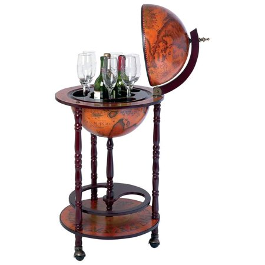

# FinalProject-WorldWineWebML
UTA Data Bootcamp Final Project - Machine Learning (with Wine!)

   
  The World Wine Web

#### Team Members
Ryan Frescas, Eric Staveley, Eric Tonian

## Project Goal
Our goal is to utilize Natural Language Processing (NLP) for Machine Learning in order to predict rating and/or price from the description of the wine. In order to do this we will take the following steps:
  1) Gather data -- use a combination of existing data from WineEnthusiast and newly scrapped data to create a large enough        dataset to train the model.
  2) Pre-process data -- clean wine description through removal of punctuation, tokenization, removal of stop words,                stemming/lemmatizing, vectorizing with TF-IDF.
  3) Model selection -- choose models with best theoretical fit (such as Multinomial Naive Bayes), train, test, compare!

## Presentation
Intro - Us, Topic, Goal *Eric T*  
Data - Source, Scrape (ETL) *Ryan*  
Desc. Analysis - Description, Sentiment, word2vec *Ryan*   
ML Models - Price/Points, Variety, Country; how we decided to filter data, what methods did we need to use, why did we pick               this/these models *Eric&Eric*   
Conclusion- what we found (is it useful?), what can we build off of this, what we learned *All*  

## Data Source
1) Wine Review Dataset- 180k+ wine reviews with variety, location, winery, price, and description https://www.kaggle.com/zynicide/wine-reviews
2) Our own scrapping of the same source to add new reviews to the existing dataset (from https://winemag.com/)

## ETL Process

## Text Analysis

## ML Models

## Conclusion
