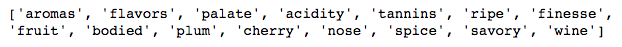
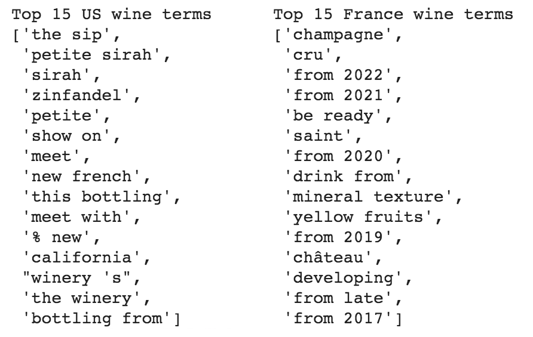

# FinalProject-WorldWineWebML
UTA Data Bootcamp Final Project - Machine Learning (with Wine!)

   
  The World Wine Web

#### Team Members
Ryan Frescas, Eric Staveley, Eric Tonian

## Project Goal
Our goal is to utilize Natural Language Processing (NLP) for Machine Learning in order to predict a number of dependent variables (price, points, country, varietal) from the description of the wine. In order to do this, we will take the following steps:
  1) ETL: use a combination of existing data from WineEnthusiast and newly scrapped data to create a large enough dataset to train the model.
  2) Textual Analysis: analyze the wine descriptions that will make up our explanatory variable by exploring word counts, performing sentiment analysis, and looking for word associations with word2vec.
  3) Pre-processing and Model selection: prepare data through removal of stop words, tokenization, vectorization, over/under sampling. Then choose variety of models for each of our dependent variables with best theoretical fit, train, test, compare!

## Presentation
Intro - Us, Topic, Goal *Eric T*  
Data - Source, Scrape (ETL) *Ryan*  
Desc. Analysis - Description, Sentiment, word2vec *Ryan*   
ML Models - Price/Points, Variety, Country; how we decided to filter data, what methods did we need to use, why did we pick               this/these models *Eric&Eric*   
Conclusion- what we found (is it useful?), what can we build off of this, what we learned *All*  

## Original Data Source

[Wine Review Dataset](https://www.kaggle.com/zynicide/wine-reviews)- 130k+ wine reviews from WineEnthusiast with variety, location, winery, price, and description

## ETL Process

1. Our own additional scrapping of the same source: [WineEnthusiast](https://winemag.com/)
2. Dataset was 180k+, but after cleaning was closer to 170k

## Sentiment and Text (Description) analysis

- New Packages used: [TextBlob](https://textblob.readthedocs.io/en/dev/quickstart.html#sentiment-analysis), [ScatterText](https://github.com/JasonKessler/scattertext), [Spacy](https://spacy.io/)

First, we need to get the sentiment score for our description data:
   

     
   

Visualization of our word count for descriptions:
  

     
  

We can then analyze the most common words within our dataset:
   

     <strong>Top Unigrams without Stop Words</strong>
      
   

   

     <strong>Top Bigrams without Stop Words</strong>
      
   

   

     <strong>Top Trigrams without Stop Words</strong>
      
   

Finally, we can find the characteristic terms and the associates of the text:
   

     <strong>Top 20 words that differentiate between a general English corpus</strong>
      
   

   

     <strong>Top 15 words for any US or France Wine (for example)</strong>
      
      
   

## Word2Vec

- New Packages used: [Gensim word2vec model](https://radimrehurek.com/gensim/models/word2vec.html#gensim.models.word2vec.Word2Vec), [Natural language toolkit (NLTK)](https://www.nltk.org/)

1. After getting the data parsed correctly we tested multiple varieties of _min_word_count_, _num_features_ or _window(context_size)_. Decided to go with a mid range of _min_word_count = 5_, _num_features = 100_ and _window(context_size) = 10_ for less noise.

2. Word2Vec has a "most similar" predicting function that will provide words that are similar to what you search.

3. Some examples:
   

      
   

   

      
   

   

      
   

   

      
   

## ML Models
### Preprocessing
---
Since we are dealing with a string of text as the explanatory variable, our model pipeline cleans the strings, removes stop words and creates a matrix of token counts using CountVectorizer. That matrix is then transformed to a TF-IDF matrix (TfidfTransformer), which gives different weights to the tokens rather than just a pure count. It is then this TF-IDF matrix that is used in the various regression and classification models below to predict the dependent variables.

### Regression Analysis - Price
---
Our first variable to test is price, as that was the original goal of our project. To keep it simple, we first utilize a simple linear regression (just one explanatory variable) at the end of our model pipeline. The results below, while disappointing, are very informative in telling us that this may not be the most useful relationship to explore:

<strong>Simple Linear Regression Model - Price</strong> 
  Accuracy: 0.08765114373376037 
  Mean Squared Error (MSE): 1002.207709822421 
  R-squared (R2): 0.4096926120577138

Just to check for any improvement, we try using the Linear SVR model, which will only allow for points within a specific boundary of tolerance in order to minimize error. The results below, while marginally different, still tell us that we may be barking up the wrong tree:

<strong>LinearSVR Model - Price</strong> 
  Accuracy: 0.12537641559159662 
  Mean Squared Error (MSE): 1464.547758400848 
  R-squared (R2): 0.13737107257783931

Looking at these results of the price models, price does not seem to be accurately predicted by the wine's description. As with many things in life, the cost of something does not always equate to it's qualitative attributes so it makes sense that the description itself does not reveal details of the wine's price.

### Regression Analysis - Points
---
Instead of giving up on our regression analysis, we turn to the points variable. This is essentially a 100-point scale rating that the reviewer gives the wine. Using the same exact models as we did for price, we can see a dramatic difference in the model accuracy:

<strong>Simple Linear Regression Model - Points</strong> 
  Accuracy: 0.7121472485887046 
  Mean Squared Error (MSE): 1.9864033844341002 
  R-squared (R2): 0.8069739225932919

<strong>LinearSVR Model - Points</strong> 
  Accuracy: 0.7401888641421794 
  Mean Squared Error (MSE): 2.455881789969409 
  R-squared (R2): 0.7613529899278689

These results tell us that the wine description can potentially give us useful predictions on the rating that the reviewer gives it. Taking a step back this can be reasonably explained, as the general sentiment (i.e. the reviewer's enthusiasm for the wine) within the description ought to relate to what rating the wine receives. 

### Classification Analysis - Varietal
---
Turning to the classification models, variety seems a likely choice as one would expect wines of a certain type to have similar flavor profiles even when considering other factors like price or region. It is important to note that there are a wide range of varieties within the data set but their respective sample sizes are not balanced, which is taken into consideration by limiting the data to the top 20 varietals and also with imblearn's under sampling method, NearMiss.

  <strong>Variety Counts</strong> 
  

The first model is a simple NB model with a matrix of count-vectorized description tokens and the top 20 varietals, which shows that there is some predictive power of the description on variety, with some varieties performing much better than others (ex. Grüner Veltliner vs. Merlot):

  <strong>Naive Bayes Classification Model - Variety</strong>
   

The next model takes into account not only the count of the tokens but also their varying weights using the TF-IDF transformer and by using the logisic method, which is better suited to larger data sets. The results show a strong improvement over the NB model, as seen below:

  <strong>TF-IDF Logistic Classification Model - Variety</strong>
   

The final model utilizes the linear SCV method, which operates similarly to the SVR method used previously on the continuous variables but is meant for classification problems. As seen below this model seems to perform as well, if not better than the other models.

  <strong>TF-IDF SVC Classification Model - Variety</strong>
   

The variety model results above can lead us to conclude that there may be some predictive power of description on variety but it is not a perfect predictor. The imbalance of the dataset may have a strong role in affecting this predictive power but that is an issue that can only be properly solved with better data. It is interesting to note the various scores of the varietals, as one can see that some are much more easily predicted than others. This can mean that some wine types are very specific in their flavor profiles while some can vary in taste widely, perhaps due to the grapes themselves or other factors like the number of different growing regions for each grape.

### Classification Analysis - Country
---
44 countries are represented in the dataset of 171,059 reviews but as seen below the data is very imbalanced:

  <strong>Review Counts By Country</strong> 
  

This imbalance will dramatically affect the learning portion of the model, and thus the prediction results will bias the countries with more reviews. Therefore, there is a need to balance the data to improve the accuracy of the models. imblearn has several strategies to address this imbalance:
<ul>
  <li>Undersampling with NearMiss -- reduces the number of samples in the high frequency classes</li>
  <li>Oversampling with SMOTE (Synthetic Minority Oversampling Technique) -- smartly generates samples for the under-represented classes, without simple duplication of existing data</li>
</ul>

Looking at the data, and shaping the learning dataset to provide best execution times, we limit the data to the top ten countries for the three models chosen (to expedite processing and review results)

<strong>CATEGORICAL NAIVE BAYES MODEL</strong> 
  normal Pipeline Score: 0.8501827040194885 
  SMOTE Pipeline Score: 0.8228380024360535 
  NearMiss Pipeline Score: 0.40907429963459196

<strong>TF-IDF LOGISTIC REGRESSION MODEL:</strong> 
  normal Pipeline Score: 0.8799634591961023 
  SMOTE Pipeline Score: 0.8743909866017052 
  NearMiss Pipeline Score: 0.48133373934226553

<strong>TF-IDF LINEAR SVC MODEL:</strong> 
  normal Pipeline Score: 0.8983861144945189 
  SMOTE Pipeline Score: 0.8786236297198539  <<<------- BEST WITH OVERSAMPLING! 
  NearMiss Pipeline Score: 0.55231425091352

  

So, for country determination by description modeling, our best results are from TF-IDF LINEAR SVC Model with Oversampling!

The pipeline:  
 CountVectorizer  (discounts stops words, tokenizes, hashes to count matrix)  
 TfidfTransformer  (transforms count matrix to term-frequency times inverse document-frequency, to have the more unique words be relevant from our corpus)  
 SMOTE  (performs the oversampling to computationally add to the lesser reviewed countries)  
 LinearSVC  (Linear Support Vector Classification scales well to large #'s of samples to find "best fit" to categorize the data)  

Then....Fit, Predict:  

  <strong>TF-IDF SVC Model</strong> 
  

  
By using the TF-IDF LINEAR SVC Model and oversampling from our Top 10 most common countries, we are able to better predict country from the wine review description.  

By developing an application with a front-end choice, where a user could pick a geographic region or continent desired, we could definitely predict and recommend a wine for them that meets their selected criteria of geography, with price and variety as possible filters.
    

<strong>OTHER MODELS REVIEWED (scores are the normal Pipeline):</strong> 
  Categorical Bigram Naive Bayes (Accuracy: 0.7947503799836315) 
  Word Count Logistic Regression (Accuracy: 0.8462527768034608) 
  Normalized Word Count Logistic Regression (Accuracy: 0.8462527768034608) 
  Bigram TF-IDF Logistic Regression (Accuracy: 0.8539985969835145) 
  TF-IDF Logistic Regression with Automatic Corpus Specific Stop Words (Accuracy: 0.8578861218285981) 
  Linear Discrete Analysis (kernel panic !) 
  TF-IDF Linear SVC (Accuracy: 0.881942008651935)

## Conclusion

