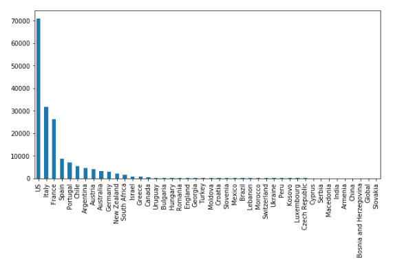
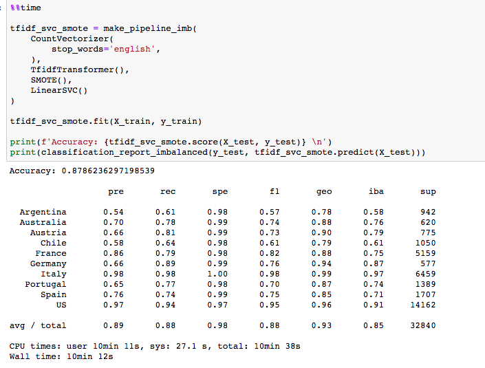

# FinalProject-WorldWineWebML
UTA Data Bootcamp Final Project - Machine Learning (with Wine!)

   
  The World Wine Web

#### Team Members
Ryan Frescas, Eric Staveley, Eric Tonian

## Project Goal
Our goal is to utilize Natural Language Processing (NLP) for Machine Learning in order to predict rating and/or price from the description of the wine. In order to do this we will take the following steps:
  1) Gather data -- use a combination of existing data from WineEnthusiast and newly scrapped data to create a large enough        dataset to train the model.
  2) Pre-process data -- clean wine description through removal of punctuation, tokenization, removal of stop words,                stemming/lemmatizing, vectorizing with TF-IDF.
  3) Model selection -- choose models with best theoretical fit (such as Multinomial Naive Bayes), train, test, compare!

## Presentation
Intro - Us, Topic, Goal *Eric T*  
Data - Source, Scrape (ETL) *Ryan*  
Desc. Analysis - Description, Sentiment, word2vec *Ryan*   
ML Models - Price/Points, Variety, Country; how we decided to filter data, what methods did we need to use, why did we pick               this/these models *Eric&Eric*   
Conclusion- what we found (is it useful?), what can we build off of this, what we learned *All*  

------> eric s stuff begins here <----------

### Country Modeling  

Libraries Used:
pandas (Dataframe visualization)
collections (utility counting/filtering)
sklearn (modelling)
imblearn (imbalanced learn libraries to undersample/oversample to balance the dataset)

DATA SET:  
171,059 reviews  
44 unique countries  

COUNTRY #Reviews  
US                        70956  
Italy                     31757  
France                    26183  
Spain                      8609  
Portugal                   6913  
Chile                      5284  
Argentina                  4567  
Austria                    3866  
Australia                  3148  
Germany                    2917  
New Zealand                1935  
South Africa               1582  
Israel                      689  
Greece                      566  
Canada                      336  
Uruguay                     228  
Bulgaria                    202  
Hungary                     187  
Romania                     143  
England                     123  
Georgia                     113  
Turkey                      107  
Moldova                     100  
Croatia                      85  
Slovenia                     84  
Brazil                       73  
Mexico                       73  
Lebanon                      35  
Morocco                      34  
Switzerland                  20  
Peru                         17  
Ukraine                      17  
Luxembourg                   16  
Kosovo                       16  
Czech Republic               14  
Serbia                       12  
Macedonia                    12  
Cyprus                       12  
India                         9  
Armenia                       7  
China                         6  
Bosnia and Herzegovina        3  
Global                        2  
Slovakia                      1  

   
  Review Counts By Country  

The imbalance of the country counts affects the learning portion of the model, and thus the prediction results will bias the countries with more reviews.  Therefore, there is a need to balance the data to improve the accuracy of the models.  

imbalanced-learn showed several strategies to address this imbalance:  
 undersampling: (NearMiss module: to reduce the number of samples in the high freq countries)  
 oversampling: (SMOTE- Synthetic Minority Oversampling Technique : to smartly generate additional   samples for the under-represented countries, without simple duplication of existing data)  

Looking at the data, and shaping the learning dataset to provide best execution times, we chose 10 (TEN) countries to model in the three models chosen (to expeditie processing and review results)  

Modeling Results with Sampling Strategies:  

CATEGORICAL NAIVE BAYES MODEL:  
normal Pipeline Score: 0.8501827040194885  
SMOTE Pipeline Score: 0.8228380024360535  
NearMiss Pipeline Score: 0.40907429963459196  

TF-IDF LOGISTIC REGRESSION MODEL:  
normal Pipeline Score: 0.8799634591961023  
SMOTE Pipeline Score: 0.8743909866017052  
NearMiss Pipeline Score: 0.48133373934226553  

TF-IDF LINEAR SVC MODEL:  
normal Pipeline Score: 0.8983861144945189  
SMOTE Pipeline Score: 0.8786236297198539  <<<------- BEST WITH OVERSAMPLING!  
NearMiss Pipeline Score: 0.55231425091352  

So, for country determination by description modeling, we chose the  
  
TF-IDF LINEAR SVC Model with Oversampling  
  
The pipeline:  
 CountVectorizer  (discounts stops words, tokenizes, hashes to count matrix)  
 TfidfTransformer  (transforms count matrix to term-frequency times inverse document-frequency, to have the more unique words be relevant from our corpus)  
 SMOTE  (performs the oversampling to computationally add to the lesser reviewed countries)  
 LinearSVC  (Linear Support Vector Classification scales well to large #'s of samples to find "best fit" to categorize the data)  

Then....Fit, Predict:  

   
  TF-IDF SVC Model

CONCLUSION:  
By using the TF-IDF LINEAR SVC Model and oversampling from our Top 10 most common countries, we are able to better predict country from the wine review description.  

By developing an application with a front-end choice, where a user could pick a geographic region or continent desired, we could definitely predict and recommend a wine for them that meets their selected criteria of geography, with price and variety as possible filters.
    

ADDENDA:  
OTHER MODELS REVIEWED (Scores are the basic pipeline):  
Gaussian Naive Bayes (dnf)  
Categorical Bigram Naive Bayes (normal pipeline Accuracy: 0.7947503799836315)  
Word Count Logistic Regression (normal pipeline Accuracy: 0.8462527768034608)  
Normalized Word Count Logistic Regression (normal pipeline Accuracy: 0.8462527768034608)  
Bigram TF-IDF Logistic Regression (normal pipeline Accuracy: 0.8539985969835145)  
TF-IDF Logistic Regression with Automatic Corpus Specific Stop Words (normal pipeline Accuracy: 0.8578861218285981)  
Linear Discrete Analysis (kernel panic !)  
TF-IDF Linear SVC (normal pipeline Accuracy: 0.881942008651935)  

------> eric s stuff ends here <----------  

## Data Source
1) Wine Review Dataset- 180k+ wine reviews with variety, location, winery, price, and description https://www.kaggle.com/zynicide/wine-reviews
2) Our own scrapping of the same source to add new reviews to the existing dataset (from https://winemag.com/)

## ETL Process

## Text Analysis

## ML Models

## Conclusion
